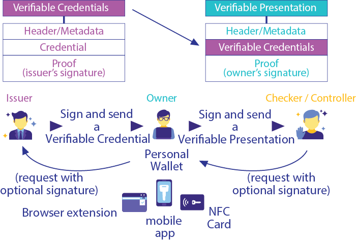

# Credenciales Verificables

## Que es una Credencial Verificable?

En el mundo físico, una credencial puede consistir en:

- Información relacionada con la identificación del sujeto de la credencial (por ejemplo, una foto, nombre o número de identificación)
  Información relacionada con la autoridad emisora ​​(por ejemplo, un gobierno de la ciudad, una agencia nacional o un organismo de certificación)

- Información relacionada con el tipo de credencial que se trata (por ejemplo, un pasaporte holandés, una licencia de conducir estadounidense o una tarjeta de seguro médico)

- Información relacionada con atributos o propiedades específicas que afirma la autoridad emisora ​​sobre el tema (por ejemplo, nacionalidad, las clases de vehículos con derecho a conducir o fecha de nacimiento)

- Evidencia relacionada con cómo se obtuvo la credencial

- Información relacionada con las restricciones de la credencial (por ejemplo, fecha de vencimiento o términos de uso).

Una credencial verificable **puede representar toda la misma información que representa una credencial física**. La adición de tecnologías, como las firmas digitales, hace que las credenciales verificables sean más evidentes y más confiables que sus contrapartes físicas.

Los titulares de credenciales verificables pueden generar presentaciones verificables y luego compartir estas presentaciones verificables con los verificadores para demostrar que poseen credenciales verificables con ciertas características.

**La palabra "verificable"** en los términos credencial verificable y presentación verificable se refiere a la característica de una credencial o presentación de **poder ser verificada por un verificador**. La verificabilidad de una credencial **no implica que se pueda evaluar la veracidad de las afirmaciones codificadas en ella**; sin embargo, el emisor puede incluir valores en la propiedad de evidencia para ayudar al verificador a aplicar su lógica de negocios para determinar si los reclamos tienen suficiente veracidad para sus necesidades.

### Ejemplo de Credencial Verificable

```
{

  "@context": [
    "https://www.w3.org/2018/credentials/v1",
    "https://www.w3.org/2018/credentials/examples/v1"
  ],
  "id": "http://example.edu/credentials/1872",
  "type": ["VerifiableCredential", "AlumniCredential"],
  "issuer": "https://example.edu/issuers/565049",
  "issuanceDate": "2010-01-01T19:23:24Z",
  "credentialSubject": {
    "id": "did:example:ebfeb1f712ebc6f1c276e12ec21",
    "alumniOf": {
      "id": "did:example:c276e12ec21ebfeb1f712ebc6f1",
      "name": [{
        "value": "Example University",
        "lang": "en"
      }, {
        "value": "Exemple d'Université",
        "lang": "fr"
      }]
    }
  },
  "proof": {
    "type": "RsaSignature2018",
    "created": "2017-06-18T21:19:10Z",
    "proofPurpose": "assertionMethod",
    "verificationMethod": "https://example.edu/issuers/565049#key-1",
    "jws": "eyJhbGciOiJSUzI1NiIsImI2NCI6ZmFsc2UsImNyaXQiOlsiYjY0Il19..TCYt5X
      sITJX1CxPCT8yAV-TVkIEq_PbChOMqsLfRoPsnsgw5WEuts01mq-pQy7UJiN5mgRxD-WUc
      X16dUEMGlv50aqzpqh4Qktb3rk-BuQy72IFLOqV0G_zS245-kronKb78cPN25DGlcTwLtj
      PAYuNzVBAh4vGHSrQyHUdBBPM"
  }
}
```

## Presentación de una Credencial Verificable

El hecho de poseer una credencial no te hace subject de la misma.

Las presentaciones son datos derivados de una o más credenciales verificables, emitidas por uno o más emisores, que se comparten con un verificador específico. Una presentación verificable es una presentación a prueba de manipulaciones codificada de tal manera que se puede confiar en la autoría de los datos después de un proceso de verificación criptográfica. Ciertos tipos de presentaciones verificables **pueden contener datos que se sintetizan a partir de las credenciales verificables originales**, pero que no las contienen (por ejemplo, **pruebas de conocimiento cero**).



## Flujo de Uso

En el siguiente gráfico se observa un caso de uso desde el momento en que se obtiene la credencial hasta que se presenta utilizando selective disclosure.


## Generar Credencial

### DID Issuer

> did:modena:matic:EiDxVyreUxU_nBYhtifpAXC7PcgMJ3DLkl_1Vdxy0Izg0w

### DIDDocument

El DID posee dos verification methods bbsbls2020 con el cual puede firmar sus credenciales.
En la demo se van a realizar firmas y verificaciones utilizando ambas.

```
{
    "@context": [
        "https://www.w3.org/ns/did/v1",
        "https://w3id.org/security/suites/jws-2020/v1",
        {
            "@vocab": "https://www.w3.org/ns/did#"
        }
    ],
    "id": "did:modena:matic:EiDxVyreUxU_nBYhtifpAXC7PcgMJ3DLkl_1Vdxy0Izg0w",
    "verificationMethod": [
        {
            "id": "#didComm",
            "controller": "did:modena:matic:EiDxVyreUxU_nBYhtifpAXC7PcgMJ3DLkl_1Vdxy0Izg0w",
            "type": "X25519KeyAgreementKey2019",
            "publicKeyJwk": {
                "kty": "EC",
                "crv": "secp256k1",
                "x": "yiXATfRlLw4aO1tRtFFisA",
                "y": "mbkXS0oOSxAIWQGq6WOm7g"
            }
        },
        {
            "id": "#bbsbls",
            "controller": "did:modena:matic:EiDxVyreUxU_nBYhtifpAXC7PcgMJ3DLkl_1Vdxy0Izg0w",
            "type": "Bls12381G1Key2020",
            "publicKeyJwk": {
                "kty": "EC",
                "crv": "secp256k1",
                "x": "iCBRlnrLRp1KxQtm8MI3xqX5zTh10MeO3-fS4G1t9imtnqeqlBE-qw32lFrLGxHx",
                "y": "DEN6O8CxB9lJYrAwPh7a7ZO9kyoEuKQeSsVM-nK3RAYUbYuYSym4bf60P5k6hKU8"
            }
        },
        {
            "id": "#bbsbls-2",
            "controller": "did:modena:matic:EiDxVyreUxU_nBYhtifpAXC7PcgMJ3DLkl_1Vdxy0Izg0w",
            "type": "Bls12381G1Key2020",
            "publicKeyJwk": {
                "kty": "EC",
                "crv": "secp256k1",
                "x": "rcKKxoojkcK-L7QT3N_6qCTexa_LCUS4Jaz0bou7B_BwFpzuEardCvKCB3cdF4Nt",
                "y": "Fzovy9zuKK__T5qqeFRsSp6aFY-uRGf2EFYcvjZLQONCnQDYyj8HcN1b4sSj1z7u"
            }
        }
    ],
    "keyAgreement": [
        "#didComm"
    ],
    "assertionMethod": [
        "#bbsbls",
        "#bbsbls-2"
    ],
    "service": [
        {
            "id": "#vc-to-sign",
            "type": "vc-download",
            "serviceEndpoint": "https://run.mocky.io/v3/57acba02-3d56-4719-a560-a4bc32a7c8e8"
        }
    ]
}
```

Credencial de ejemplo: Vaccine

[https://w3c-ccg.github.io/vaccination-vocab/](https://w3c-ccg.github.io/vaccination-vocab/)

```
{
  "@context": [
    "https://www.w3.org/2018/credentials/v1",
    "https://w3id.org/vaccination/v1"
  ],
  "type": [
    "VerifiableCredential",
    "VaccinationCertificate"
  ],
  "id": "urn:uvci:af5vshde843jf831j128fj",
  "name": "COVID-19 Vaccination Certificate",
  "description": "COVID-19 Vaccination Certificate",
  "issuanceDate": "2019-12-03T12:19:52Z",
  "expirationDate": "2029-12-03T12:19:52Z",
  "issuer": "did:key:z6MkiY62766b1LJkExWMsM3QG4WtX7QpY823dxoYzr9qZvJ3",
  "credentialSubject": {
    "type": "VaccinationEvent",
    "batchNumber": "1183738569",
    "administeringCentre": "MoH",
    "healthProfessional": "MoH",
    "countryOfVaccination": "NZ",
    "recipient": {
      "type": "VaccineRecipient",
      "givenName": "JOHN",
      "familyName": "SMITH",
      "gender": "Male",
      "birthDate": "1958-07-17"
    },
    "vaccine": {
      "type": "Vaccine",
      "disease": "COVID-19",
      "atcCode": "J07BX03",
      "medicinalProductName": "COVID-19 Vaccine Moderna",
      "marketingAuthorizationHolder": "Moderna Biotech"
    }
  }
}
```

### Crear credencial utilizando VerifiableCredentialService

```
const vcService = new VerifiableCredentialService();

const credential = await vcService.createCredential({
    context: ["https://w3id.org/vaccination/v1",
        "https://w3id.org/security/v2",
        "https://w3id.org/security/bbs/v1"],
    vcInfo: {
        "issuer": "did:modena:matic:EiBir9q1nNlEmNFs1APYAsWbdVMnDVp0Wy1MWYLQPcSFuw",
        expirationDate: new Date("2026/05/05"),
        id: "123456789",
        types: ["VaccinationCertificate"],
    },
    data: {
        type: "VaccinationEvent",
        batchNumber: "1183738569",
        administeringCentre: "MoH",
        healthProfessional: "MoH",
        countryOfVaccination: "NZ",
        recipient: {
            type: "VaccineRecipient",
            givenName: "JOHN",
            familyName: "SMITH",
            gender: "Male",
            birthDate: "1958-07-17"
        },
        vaccine: {
            type: "Vaccine",
            disease: "COVID-19",
            atcCode: "J07BX03",
            medicinalProductName: "COVID-19 Vaccine Moderna",
            marketingAuthorizationHolder: "Moderna Biotech"
        }
    },
    mappingRules: null,
});
```

## Firmar Credencial

```
const vc = await kms.signVC(Suite.Bbsbls2020,
bbsbls2020[0],
credential,
issuerDid,
issuerDidMethod,
new AssertionMethodPurpuse());
```

## Verificar VC

```
const result = await service.verify(vc, new AssertionMethodPurpuse());
```

## Firmar utilizando un purpose diferente a AssertionMethod

```
const vc = await kms.signVC(Suite.Bbsbls2020,
bbsbls2020[0],
credential,
"did:modena:matic:EiBir9q1nNlEmNFs1APYAsWbdVMnDVp0Wy1MWYLQPcSFuw",
"did:modena:matic:EiBir9q1nNlEmNFs1APYAsWbdVMnDVp0Wy1MWYLQPcSFuw#bbsbls", new KeyAgreementPurpose());
```

## Firmar utilizando el purpose AssertionMethod pero verificando otro purpose

```
const result = await service.verify(vc,
new KeyAgreementPurpose()); // KeyAgreementPurpose is not ok to verify
```

## Firmar utilizando el segundo par de claves bbs pero indicando el VerificationMethod del primer par en la firma

```
const vc = await kms.signVC(Suite.Bbsbls2020,
        bbsbls2020[0],
        credential,
        "did:modena:matic:EiDxVyreUxU_nBYhtifpAXC7PcgMJ3DLkl_1Vdxy0Izg0w",
        "did:modena:matic:EiDxVyreUxU_nBYhtifpAXC7PcgMJ3DLkl_1Vdxy0Izg0w#bbsbls-2", new AssertionMethodPurpuse());
```

## Firmar utilizando el segundo par de claves bbs indicando bien el VerificationMethod

```
const vc = await kms.signVC(Suite.Bbsbls2020,
        bbsbls2020[0],
        credential,
        "did:modena:matic:EiDxVyreUxU_nBYhtifpAXC7PcgMJ3DLkl_1Vdxy0Izg0w",
        "did:modena:matic:EiDxVyreUxU_nBYhtifpAXC7PcgMJ3DLkl_1Vdxy0Izg0w#bbsbls-2", new AssertionMethodPurpuse());
```
