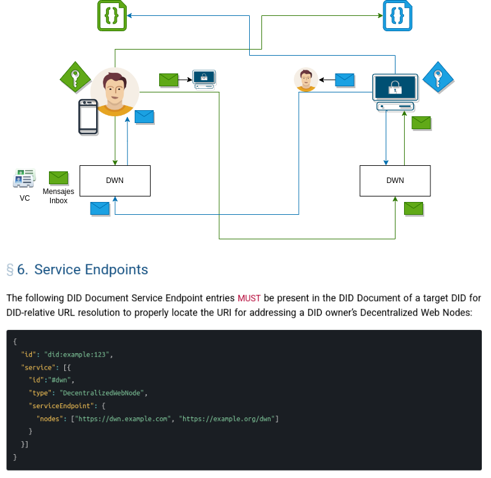

# Interacción con el mundo exterior - DWN - DID Document - VC - WACI

Los estandares de W3C menciona la posibilidad de realizar las comunicaciones entre dos DIDs a través del servicio del DWN.

Este servicio funciona como un servicio de Inbox que permite la funcionalidad de levantar mensajes que le están enviando a un DID en específico. De la misma forma, un DID especifico puede enviar mensajes al DWN de otro DID.

Podemos utilizar este concepto para enviar credenciales verificables a otro DID, ya sea porque la misma se acaba de crear o porque queremos presentar una credencial verificable 




Las solicitudes de creación de credenciales, el envío de credenciales y la solicitud para verificar credenciales pueden realizarse utilizando el protocolo WACI y enviando mensajes encriptados con DIDComm al DWN.


## DWN Client NPM

```
npm i @extrimian/dwn-client
npm i @extrimian/dwn-client-scheduler
```

### Documentación
```
https://docs.extrimian.com/es/sdk/dwn-client
```

## Inicializar DWN Client
```
export interface DWNClientConfig {
  did : string;
  inboxURL : string;
  storage : MessageStorage;
}

export interface MessageStorage {
  saveMessages(messages : Entry[]) : Promise<void>;
  getMessages() : Promise<Entry[]>;
  getLastPullDate() : Promise<Date>;
  updateLastPullDate(date : Date) : Promise<void>;
}

const dwnClient = new DWNClient(dwnClientConfig)
```

```
export const storageMock : MessageStorage = {
  async getMessages() : Promise<Entry[]> {
    return messagesStorage;
  },
  async getLastPullDate() : Promise<Date> {
    return lastPullDate;
  },
  async saveMessages(messages : Entry[]) : Promise<void> {
    messagesStorage.push(...messages);
  },
  async updateLastPullDate(date : Date) : Promise<void> {
    lastPullDate = date;
  },
};

```

## DWN Types

```
export type Entry = {
  descriptor : MessageDescriptor;
  data ?: any;
};
```

```
export type MessageDescriptor = {
  method : ThreadMethod;
  // UUIDv4
  objectId ?: string;
  // Content-Type header (e.g. application/json)
  dataFormat ?: string;
  // content id
  cid ?: {
    codec : string;
    version : number;
    hash : any;
  };
  // Creation date in UNIX timestamp format
  dateCreated ?: number;
  // Data Schema URL
  schema ?: string;
  // Initial thread message id
  root ?: string;
  // Parent (replying to) message id
  parent ?: string;
};

```

## Configurar el DWN para el Pulleo de mensajes

```
const dwnClientScheduler = new DWNClientScheduler(
    dwnClient,
    cronExpression
);


// Se inicia el cron para el pulleo del DWN
this.dwnClientScheduler.start();

//Se reciben nuevos mensajes en el DWN y se delega cada uno al event handler de WACI:
this.dwnClient.addSubscriber(async (messages) => {
    console.log(`Found ${messages.length} messages`);
    messages.forEach(this.sendNewMessageNotification);
});
```

```
//DWN_SCHEDULER_CRON_EXPRESSION="/10 * * * *"
```


### DWN Send Message
```
private async sendResponse(
    responseMessage : WACIResponse,
    previousMessage : DWNMessage
  ) : Promise<void> {
    const dwnUrl = await this.getTargetDwnUrl(responseMessage.target);
    const params : SendMessageParams = {
      targetDID: responseMessage.target,
      targetInboxURL: dwnUrl,
      message: {
        data: responseMessage.message,
        descriptor: {
          method: undefined,
          dateCreated: new Date(),
          dataFormat: 'application/json',
        },
      },
    };
    switch (responseMessage.responseType) {
    case WACIMessageResponseType.CreateThread:
      params.message.descriptor.method = ThreadMethod.Create;
      break;
    case WACIMessageResponseType.ReplyThread:
      params.message.descriptor.method = ThreadMethod.Reply;
      params.message.descriptor.root =
          previousMessage.descriptor.root ||
          previousMessage.descriptor.objectId;
      params.message.descriptor.parent = previousMessage.descriptor.objectId;
      break;
    default:
      throw Error('Wrong WACI response type');
    }
    await this.dwnClient.sendMessage(params).catch(console.error);
  }
```